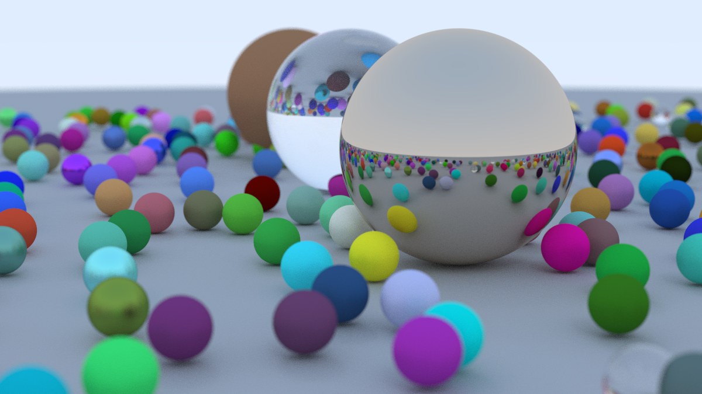

# Ray Tracing In One Weekend

## Overview

Decided to try [Peter Shirley's Ray Tracing in One Weekend](https://github.com/RayTracing/raytracing.github.io) book.

### Deviations from the tutorial

My implementation differs a bit from the one present in the book:

#### No OOP

Decided not to use object oriented programming, to avoid additional indirection.

Material stores material properties and pointer to scatter function directly (not through [VMT](https://en.wikipedia.org/wiki/Virtual_method_table)).

#### Shadow Ackne tackled in a different way

Instead of checking if ray sphere intersection is near ray origin (In case ray originated from just below the sphere), i decided to ignore exiting intersection (h + sqrt (delta)) if ray should have originated from the outside. I kept a flag marking if ray is inside an object (to handle glass).

#### Multithreaded

Program runs on multiple threads (each with it's own random number generator)

#### PNG output

Used [stb_image](https://github.com/nothings/stb/) to write output to png files.

## Building

### Dependencies

* [GLM](https://github.com/g-turc/glm/)
* [stb](https://github.com/nothings/stb/)

Project builds with Visual Studio 2022.

Set `Project -> Properties -> C/C++ -> Additional Include Directories` to point to your installations of glm and stb.